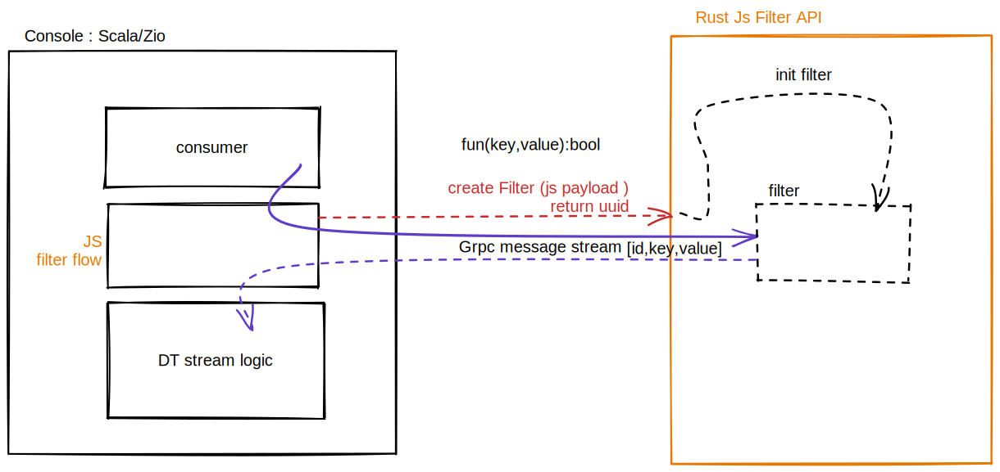

## Big picture


## Bench tools
* https://ghz.sh/docs/install

* https://github.com/bheisler/criterion.rs


## JS interpreter

* https://github.com/boa-dev/boa
* https://github.com/HiRoFa/quickjs_es_runtime

## Grpc 
* https://github.com/hyperium/tonic


## Naive Boa bench (non release build)
```sh
 ghz --insecure --proto ./proto/js-filter.proto -c 10 -n 10000 --rps 1000  --call jsfilter.Filter.filter -d '{"js":"(payload) => payload.a===\'x\'","payload":"{\\"a\\":\\"x\\"}"}' 127.0.0.1:50051
```

```sh

Summary:
  Count:        10000
  Total:        27.43 s
  Slowest:      95.67 ms
  Fastest:      16.47 ms
  Average:      27.02 ms
  Requests/sec: 364.52

Response time histogram:
  16.470 [1]    |
  24.390 [3427] |∎∎∎∎∎∎∎∎∎∎∎∎∎∎∎∎∎∎∎∎∎∎∎∎
  32.311 [5642] |∎∎∎∎∎∎∎∎∎∎∎∎∎∎∎∎∎∎∎∎∎∎∎∎∎∎∎∎∎∎∎∎∎∎∎∎∎∎∎∎
  40.231 [770]  |∎∎∎∎∎
  48.152 [122]  |∎
  56.072 [29]   |
  63.993 [1]    |
  71.913 [2]    |
  79.834 [2]    |
  87.754 [0]    |
  95.675 [4]    |

```


## Naive Quick bench  (non release build)
```sh 
ghz --insecure --proto ./proto/js-filter.proto -c 10 -n 10000 --rps 1000  --call jsfilter.Filter.filter -d '{"js":"function filter(payload){ return payload.a===\'x\'}","payload":"{\\"a\\":\\"x\\"}"}' 127.0.0.1:50051

```

```sh
Summary:
  Count:        10000
  Total:        10.29 s
  Slowest:      30.90 ms
  Fastest:      1.59 ms
  Average:      9.69 ms
  Requests/sec: 971.90

Response time histogram:
  1.588  [1]    |
  4.519  [163]  |∎∎
  7.450  [2040] |∎∎∎∎∎∎∎∎∎∎∎∎∎∎∎∎∎∎∎∎∎∎∎
  10.381 [3614] |∎∎∎∎∎∎∎∎∎∎∎∎∎∎∎∎∎∎∎∎∎∎∎∎∎∎∎∎∎∎∎∎∎∎∎∎∎∎∎∎
  13.312 [3476] |∎∎∎∎∎∎∎∎∎∎∎∎∎∎∎∎∎∎∎∎∎∎∎∎∎∎∎∎∎∎∎∎∎∎∎∎∎∎
  16.243 [647]  |∎∎∎∎∎∎∎
  19.173 [38]   |
  22.104 [12]   |
  25.035 [4]    |
  27.966 [2]    |
  30.897 [3]    |

```